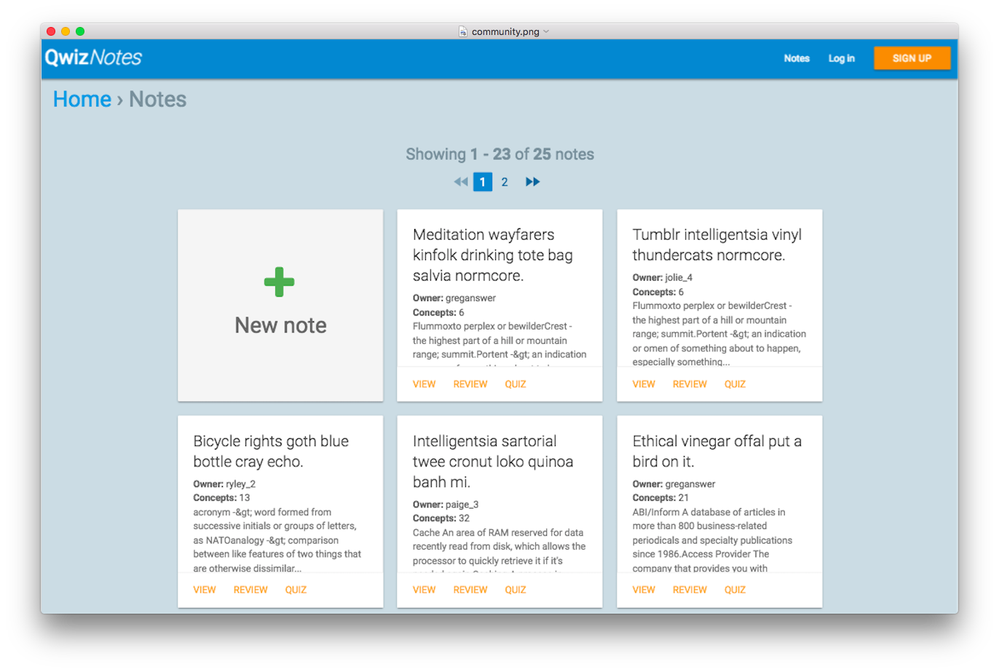

# Qwiz Notes

> Qwiz Notes is social network for students to study. It provides a distraction free environment with tools to help make studying more efficient.



## Table of contents

- [Getting started](#getting-started)
    - [System requirements](#system-requirements)
    - [Installation](#installation)
    - [Running tests](#running-tests)
    - [Additional resources](#additional-resources)
- [The Project](#the-project)
    - [Proposal](#proposal)
    - [Target](#target)
    - [Goals](#goals)
    - [Requirements](#requirements)
    - [Design considerations](#design-considerations)
- [Contributions](#contributions)
    - [Style guides](#style-guide)
    - [Localization](#localization)
    - [Reset the staging database](#reset-the-staging-database)

## Getting started

### System requirements

- Ruby 2.4.0 +
- Rails 5.0.2
- PostgreSQL
- Unix like operating system (OS X, Ubuntu, Debian, etc.)
- Not yet tested on Windows

### Installation

1. Clone or download the repository
1. Install Ruby 2.4.0 via [rbenv](https://github.com/rbenv/rbenv#installation) or [rvm](https://github.com/rvm/rvm)
1. [Install Rails](https://github.com/rails/rails) *(if not already installed)*
1. Install PostgreSQL *(if not already installed)*. Here is a list of [installation options](https://www.postgresql.org/download/) based on your development machine's operating system. I am currently using [Postgresapp](https://postgresapp.com/) and have used [Homebrew](https://brew.sh/) (Not sure why, but I had issues restarting the service this time)
1. `cd` into project directory *(If not already there)*
1. `cp config/database.yml.example config/database.yml`
1. `cp config/secrets.yml.example config/secrets.yml`
1. `rake db:create:all db:setup`
1. `rails s`
1. View in browser at *http://localhost:3000*

### Running tests

```shell
# Cucumber tests
[bundle exec] cucumber

# Rspec tests
bundle exec rspec

# Automated testing for Cucumber and Rspec
bundle exec guard
```

### Additional resources

- [List of Google Material Icons](https://material.io/icons/)
- [List of Font Awesome Icons](http://fontawesome.io/icons/)

## The Project

### Proposal

I propose that we create a social network that has tools that are condusive to studying. There should be a simple and clean text editor. There should be tools for making quizzes and even strategies for making quizzes automatically. Users should be able to favorite other users and their notes. The app should be fast and have calm yet welcoming colors. There should be no advertisements or constant notifications. 
The web app will be available through any device with a web browser and an Internet connection. Native mobile apps can be created once this web app becomes popular enough.  Offline access would be prefered for situations where an Internet connection is not possible.

### Target

 Audiences
This app is for students from Elementary to post-secondary school level.

### Goals

- Be a focused platform that increases studying efficiency and knowledge retention.
- Allow students to collaborate easily
- Allow students to effortlessly create quizzes and review their results
- Provide a platform for online tutoring (Phase 2)

### Requirements

- Every page will include a site search tool. 
- Login via Facebook or Google account.
- Guests can:
    - View single notes (non index page)
    - Take a quiz from a note
- Users must log in to:
    - Create notes
    - View all notes
    - Follow notes
    - Follow other users
    - Create comments

### Design considerations

- I chose to use [Materialize CSS](http://materializecss.com/) because I I have also read through most of [Google's Material Design Guidelines](https://material.io/guidelines/) and I agree with a lot of their opinions on User Experience. 
- I chose to go with pagination instead of infinite scroll based on [this UX article](https://uxplanet.org/ux-infinite-scrolling-vs-pagination-1030d29376f1#.nbadf7yx7).

## Contributions

### Style guides

- [Barsoom Rails style guide](https://github.com/barsoom/devbook/tree/master/styleguide)
- [UI Namespaces](https://csswizardry.com/2015/03/more-transparent-ui-code-with-namespaces/#javascript-namespaces-js-)
    - JavaScript classes: `jsButtonCollapse` (*'js'*, followed by *'noun/namespace'* followed by *'verb'*, in *camel case*)

### Localization

When adding or changing any localization keys in the YAML files, please be mindful of existing keys in other languages.

### Reset the staging database

From time to time you may need to reset the staging server database, to include new seed data, etc. Make sure you're in the `~/staging.APPNAME/current` folder. *NOTE: Change APPNAME.*

```shell
##### NOTE: Change APPNAME
rake db:environment:set RAILS_ENV=staging db:drop
sudo -u postgres createdb -O deploy APPNAME_staging
rake db:environment:set RAILS_ENV=staging db:migrate db:seed
```

